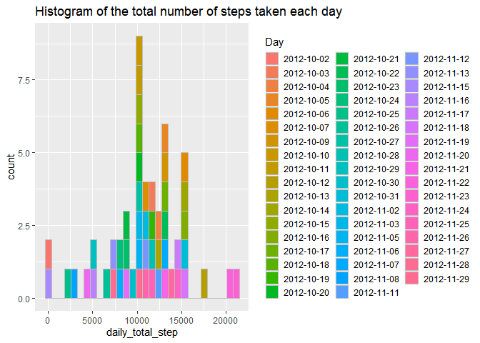
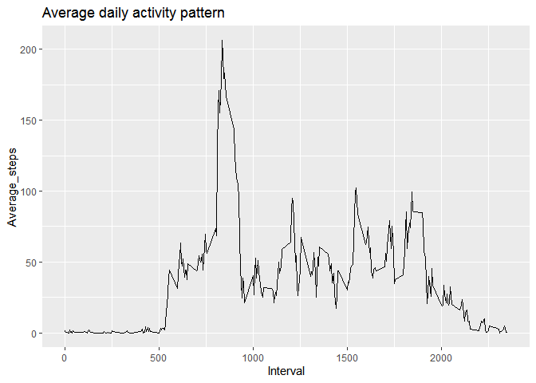
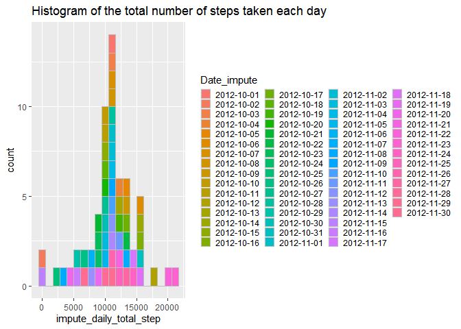
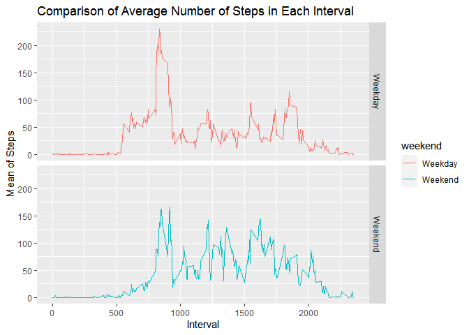

## Loading and preprocessing the data

**1. Download the data**


```r
url<- "https://d396qusza40orc.cloudfront.net/repdata%2Fdata%2Factivity.zip"
download.file(url,"Activity_monitoring_data.zip")
unzip("Activity_monitoring_data.zip")
data<- read.csv("activity.csv")
```


```r
head(data)
```

```
##   steps       date interval
## 1    NA 2012-10-01        0
## 2    NA 2012-10-01        5
## 3    NA 2012-10-01       10
## 4    NA 2012-10-01       15
## 5    NA 2012-10-01       20
## 6    NA 2012-10-01       25
```

```r
dim(data)
```

```
## [1] 17568     3
```

```r
str(data)
```

```
## 'data.frame':	17568 obs. of  3 variables:
##  $ steps   : int  NA NA NA NA NA NA NA NA NA NA ...
##  $ date    : chr  "2012-10-01" "2012-10-01" "2012-10-01" "2012-10-01" ...
##  $ interval: int  0 5 10 15 20 25 30 35 40 45 ...
```

```r
summary(data)
```

```
##      steps            date              interval     
##  Min.   :  0.00   Length:17568       Min.   :   0.0  
##  1st Qu.:  0.00   Class :character   1st Qu.: 588.8  
##  Median :  0.00   Mode  :character   Median :1177.5  
##  Mean   : 37.38                      Mean   :1177.5  
##  3rd Qu.: 12.00                      3rd Qu.:1766.2  
##  Max.   :806.00                      Max.   :2355.0  
##  NA's   :2304
```

**2. Process/transform the data**

```r
data$date<-as.Date(data$date)
```


```r
str(data)
```

```
## 'data.frame':	17568 obs. of  3 variables:
##  $ steps   : int  NA NA NA NA NA NA NA NA NA NA ...
##  $ date    : Date, format: "2012-10-01" "2012-10-01" ...
##  $ interval: int  0 5 10 15 20 25 30 35 40 45 ...
```

## What is mean total number of steps taken per day?

**1. Library the required packages**


```r
library(tidyr)
library(ggplot2)
library(dplyr)
```

```
## 
## Attaching package: 'dplyr'
```

```
## The following objects are masked from 'package:stats':
## 
##     filter, lag
```

```
## The following objects are masked from 'package:base':
## 
##     intersect, setdiff, setequal, union
```

**2. Process/transform the data**


```r
daily_data <- split(data, data$date)
```


```r
length(daily_data)
```

```
## [1] 61
```


```r
daily_total_step <- sapply(daily_data, function(x){
    sum(x[, "steps"])
})
```

***Total number of steps taken per day***


```r
Total_number_daily <- as.data.frame(daily_total_step)
Day<- rownames(Total_number_daily)
Total_number_daily<- cbind(Total_number_daily,Day)
```

***Histogram of the total number of steps taken each day***


```r
g<- ggplot(data=Total_number_daily, aes(x=daily_total_step, fill=Day))

g+geom_histogram(col="gray")+labs(title="Histogram of the total number of steps taken each day")+
        theme(legend.key.size=unit(.2,"inches"))
```

```
## `stat_bin()` using `bins = 30`. Pick better value with `binwidth`.
```

```
## Warning: Removed 8 rows containing non-finite values (stat_bin).
```

<!-- -->

***Mean and median of the total number of steps taken per day***


```r
Mean_total_per_day<- mean(Total_number_daily$daily_total_step, na.rm = TRUE)
paste("Mean:", Mean_total_per_day)
```

```
## [1] "Mean: 10766.1886792453"
```


```r
Median_total_per_day<- median(Total_number_daily$daily_total_step, na.rm = TRUE)
paste("Median:", Median_total_per_day)
```

```
## [1] "Median: 10765"
```

## What is the average daily activity pattern?

***Time series plot***


```r
split_interval_data<-split(data,data$interval)

Average_steps<- sapply(split_interval_data, function(x){
        mean(x[, "steps"], na.rm = TRUE)
})

Average_steps<-as.data.frame(Average_steps)
interval<-as.numeric(row.names(Average_steps))
Average_steps<-cbind(Average_steps,interval)

g<-ggplot(Average_steps,aes(x=interval, y=Average_steps))
g+geom_line()+labs(title = "Average daily activity pattern")+xlab("Interval")
```

<!-- -->

***Interval-835 contains the maximum number of steps.***


```r
max_interval<-max(Average_steps$Average_steps)
subset(Average_steps,Average_steps==max_interval)
```

```
##     Average_steps interval
## 835      206.1698      835
```

## Imputing missing values

***Total number of missing values in the dataset***


```r
sum(is.na(data$steps))
```

```
## [1] 2304
```

***Filling in all of the missing values using mean of that day***


```r
replacebymean<-function(x){
        replace(x, is.na(x),mean(x, na.rm = TRUE))
}

data_tb<-tbl_df(data)
```

```
## Warning: `tbl_df()` is deprecated as of dplyr 1.0.0.
## Please use `tibble::as_tibble()` instead.
## This warning is displayed once every 8 hours.
## Call `lifecycle::last_warnings()` to see where this warning was generated.
```

```r
data_impute<-data_tb %>% group_by(interval) %>% mutate(steps=replacebymean(steps))
data_impute
```

```
## # A tibble: 17,568 x 3
## # Groups:   interval [288]
##     steps date       interval
##     <dbl> <date>        <int>
##  1 1.72   2012-10-01        0
##  2 0.340  2012-10-01        5
##  3 0.132  2012-10-01       10
##  4 0.151  2012-10-01       15
##  5 0.0755 2012-10-01       20
##  6 2.09   2012-10-01       25
##  7 0.528  2012-10-01       30
##  8 0.868  2012-10-01       35
##  9 0      2012-10-01       40
## 10 1.47   2012-10-01       45
## # ... with 17,558 more rows
```

***Histogram of the total number of steps taken each day ***


```r
impute_daily_data<-split(data_impute, data_impute$date)

impute_daily_total_step <- sapply(impute_daily_data, function(x){
    sum(x[, "steps"])
})

impute_Total_number_daily <- as.data.frame(impute_daily_total_step)
Date_impute<- rownames(impute_Total_number_daily)
impute_Total_number_daily<- cbind(impute_Total_number_daily,as.Date(Date_impute))

g<- ggplot(impute_Total_number_daily, aes(x=impute_daily_total_step, fill=Date_impute))

g+geom_histogram(col="gray", bins = 20)+labs(title="Histogram of the total number of steps taken each day")+
        theme(legend.key.size=unit(.15,"inches"))
```

<!-- -->

***Mean and median total number of steps taken per day***


```r
Mean_total_per_day<- mean(Total_number_daily$daily_total_step, na.rm = TRUE)
paste("Old_Mean:", Mean_total_per_day)
```

```
## [1] "Old_Mean: 10766.1886792453"
```

```r
impute_Mean_total_per_day<- mean(impute_Total_number_daily$impute_daily_total_step, na.rm = TRUE)
paste("impute_Mean", impute_Mean_total_per_day)
```

```
## [1] "impute_Mean 10766.1886792453"
```


```r
Median_total_per_day<- median(Total_number_daily$daily_total_step, na.rm = TRUE)
paste("Old_Median:", Median_total_per_day)
```

```
## [1] "Old_Median: 10765"
```

```r
impute_Median_total_per_day<- median(impute_Total_number_daily$impute_daily_total_step, na.rm = TRUE)
paste("impute_Median", impute_Median_total_per_day)
```

```
## [1] "impute_Median 10766.1886792453"
```

***Do these values differ from the estimates from the first part of the assignment? What is the impact of imputing missing data on the estimates of the total daily number of steps?***

The old mean and old median are almost same with the imputing mean and median.

## Are there differences in activity patterns between weekdays and weekends?


```r
data_impute$date<-as.Date(data_impute$date)
data_impute$weekdays<- weekdays(data_impute$date)
data_impute$weekend <- ifelse(data_impute$weekdays=="星期六" | data_impute$weekdays=="星期日", "Weekend", "Weekday" )
meanweekday <-aggregate(data_impute$steps, by=list(data_impute$weekend, data_impute$interval), na.omit(mean))
names(meanweekday) <- c("weekend", "interval", "steps")
ggplot(meanweekday, aes(x=interval, y=steps, color=weekend)) + geom_line()+
     facet_grid(weekend ~.) + xlab("Interval") + ylab("Mean of Steps") +
     ggtitle("Comparison of Average Number of Steps in Each Interval")
```

<!-- -->
